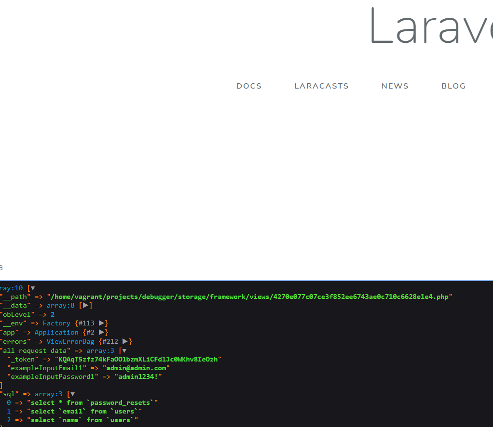

# laravel-debug-panel

A simple debug panel written in pure PHP with laravel, printing SQL queries and request input informations.

<<<< Work in progress >>>>

# Example output

After filling a simple login form, with APP_DEBUG=true in .env file:

